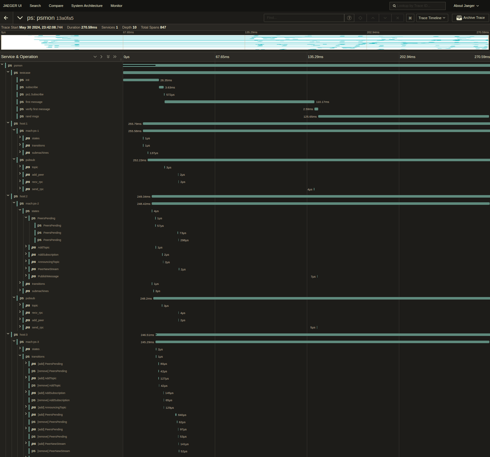
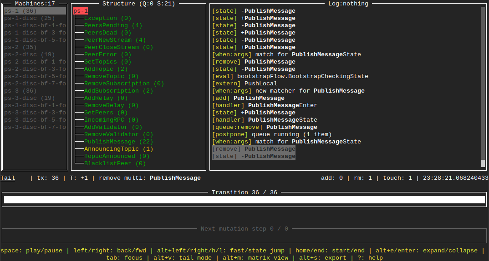
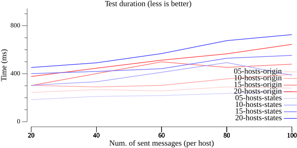
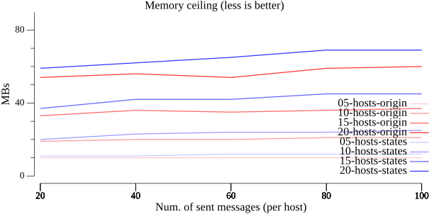
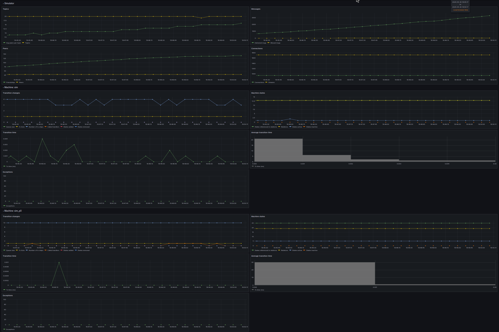
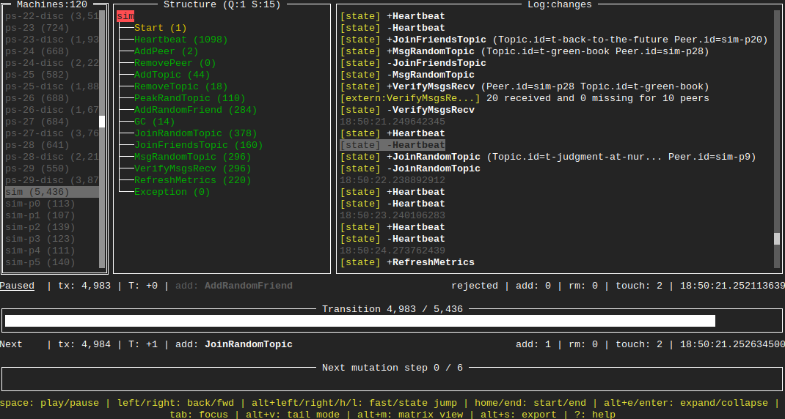

# libp2p-pubsub on asyncmachine

**libp2p-pubsub-benchmark** is a case study and stress test for [asyncmachine-go](http://github.com/pancsta/asyncmachine-go), it's telemetry and integrations. Although it's current purpose is pure research, it may develop over time into something usable.

> **asyncmachine-go** is a general purpose state machine for managing complex asynchronous workflows in a safe and structured way.

## libp2p-pubsub benchmark

- ### [See results](bench.md)

| Jaeger                                   | am-dbg                                   |
|------------------------------------------|------------------------------------------|
|  |  |

| Test duration                                   | Max memory                                                                       |
|------------------------------------------|----------------------------------------------------------------------------------|
|  |  |

`cmd/bench` compares the default [go-libp2p-pubsub](https://github.com/libp2p/go-libp2p-pubsub) implementation to the [asyncmachine version](https://github.com/pancsta/go-libp2p-pubsub/). It runs `TestSimpleDiscovery` for various host/msg configurations and presents a median for each iteration. The best way to view the results is [bench.md](bench.md), [bench.pdf](assets/bench.pdf?raw=true). Single runs can be viewed in Jaeger and am-dbg after `task test-discovery`. Benchmark uses go1.22 traces, thus needs at least this version.

Check `assets/bench-jaeger-3h-10m.traces.json` and `assets/bench-am-dbg.gob.bz2` for sample data.

Machines can be found in [go-libp2p-pubsub/states](https://github.com/pancsta/go-libp2p-pubsub/tree/psmon-states/states):

- **pubsub host** - eg `ps-17` (20 states) 
  PubSub machine is a simple event loop with Multi states which get responses via arg channels. Heavy use of `Eval`.
- **discovery** - eg `ps-17-disc` (10 states) 
  Discovery machine is a simple event loop with Multi states and a periodic refresh state.
- **discovery bootstrap** - eg `ps-17-disc-bf3` (5 states) 
  `BootstrapFlow` is a non-linear flow for topic bootstrapping with some retry logic.

Configuration file [bench.env](bench.env):

- `NUM_HOSTS` - number of hosts in the test
- `RAND_MSGS` - number of rand msgs to broadcast
- `PS_AM_DEBUG` - am-dbg telemetry for pubsub machines
- `PS_AM_LOG_LEVEL` - AM logging level for pubsub machines (0-4)
- `PS_AM_LOG_LEVEL_VERBOSE` - AM logging level for verbose pubsub machines (0-4)
- `PS_TRACING_HOST` - pubsub jaeger tracing (native tracing)
- `PS_TRACING_AM` - pubsub jaeger tracing (states and transitions)

See [bench.md](bench.md) for detailed results.

## libp2p-pubsub simulator

| Grafana                                | am-dbg                               |
|----------------------------------------|--------------------------------------|
|  |  |

`cmd/sim` starts a simulated pubsub network with a mocked discovery, creates random topics and makes peers join/leave them under various conditions, and also friend each other. The best way to view the simulator is in Grafana and am-dbg. Alternatively, `stdout` prints out basic metrics.

Check `assets/sim-am-dbg.gob.bz2` and `assets/sim-grafana.dashboard.json` for samples.

Machines can be found in [internal/sim/states](internal/sim/states) and [go-libp2p-pubsub/states](https://github.com/pancsta/go-libp2p-pubsub/tree/psmon-states/states):

- **pubsub host** eg `ps-17` (20 states) 
  PubSub machine is a simple event loop with Multi states which get responses via arg channels. Heavy use of `Eval`.
- **pubsub discovery** - eg `ps-17-disc` (10 states) 
  Discovery machine is a simple event loop with Multi states and a periodic refresh state.
- **simulator** `sim` (14 states) 
  Root simulator machine, initializes the network and manipulates it during heartbeats according to frequency definitions. Heavily dependent on state negotiation.
- **simulator's peer** - eg `sim-p17` (17 states) 
  Handles peer's connections, topics and messages. This machine has a decent amount of relations. Each sim peer has its own pubsub host.
- **topics** - eg `sim-t-se7ev` (5 states) 
  State-only machine (no handlers, no goroutine). States represent correlations with peer machines.

Configuration file [sim.env](sim.env):

- `SIM_DURATION` - duration of the simulation
- `SIM_MAX_PEERS` - maximum number of peers
- `SIM_METRICS` - grafana metrics for sim and peer machines
- `SIM_AM_DEBUG` - am-dbg telemetry for sim machines
- `SIM_AM_LOG_LEVEL` - AM logging level for sim machines (0-4)
- `PS_AM_DEBUG` - am-dbg telemetry for pubsub machines
- `PS_AM_LOG_LEVEL` - AM logging level for pubsub machines (0-4)

You can further customize the simulator in [internal/sim/sim.go](internal/sim/sim.go#L46).

## Running

Run these:

- `git clone https://github.com/pancsta/go-libp2p-pubsub-benchmark.git`
- `cd go-libp2p-pubsub-benchmark`
- `scripts/dep-taskfile.sh`
- `task install-deps`

### Benchmark Results

- run `task init-bench-repos`
- run `task bench-all` (~30min)
- open `./bench.md` for results

### Benchmark Traces

- run `task start-env`
- run `task start-am-dbg`
- switch TTY
- run `task test-discovery-states`
- visit the first TTY for am-dbg history
  - requires `PS_AM_DEBUG`
- visit http://localhost:16686/ for Jaeger
  - requires `PS_TRACING_HOST` or `PS_TRACING_AM`

### Simulator

- run `task start-env`
- run `task start-am-dbg`
- visit Grafana at http://localhost:3000/dashboard/import 
  - import `assets/sim-grafana.dashboard.json`
  - or `task gen-grafana-dashboard` and provide machine IDs via `GRAFANA_IDS`
- switch TTY 
- run `task start-sim`
- visit the first TTY for am-dbg history
  - requires `SIM_AM_DEBUG`
- visit the Grafana dashboard at http://localhost:3000/d/f4ac0cf1-0f3d-4b41-9e04-d6b0e68b49bc/?orgId=1&refresh=5s&from=now-5m&to=now
  - requires `SIM_METRICS`

## Diff

See all the changes to `go-libp2p-pubsub` needed to make it work on [asyncmachine-go]().

- **[full diff against libp2p/go-libp2p-pubsub](https://github.com/libp2p/go-libp2p-pubsub/compare/master...pancsta:go-libp2p-pubsub:psmon-states)**
- [pubsub machines](https://github.com/pancsta/go-libp2p-pubsub/tree/psmon-states/states)

Main changes are in the following files:

- pubsub.go
- comm.go
- gossipsub.go
- states files

## TODO

- reimplement more things as machines
- fix benchmark failures
