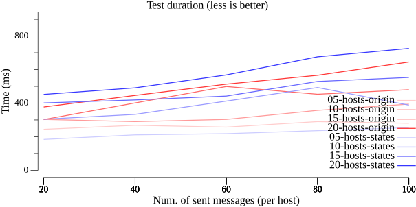

# libp2p-pubsub-benchmark

Benchmarking [asyncmachine-go](https://github.com/pancsta/asyncmachine-go) based implementation of [libp2p-pubsub](https://github.com/libp2p/go-libp2p-pubsub) from [github.com/pancsta/go-libp2p-pubsub](https://github.com/pancsta/go-libp2p-pubsub).

## TestSimpleDiscovery #1

Versions being compared

- origin
- state based (RPC as a channel)

Steps taken in the test

1. Init a pubsub network of `{h}` hosts
2. Subscribe with all but host0
3. Publish a single message from host0
4. Publish random msgs - `{m}` per host

Variables

- `h:hosts` Num. of hosts in the pubsub network
  - 5 to 20
  - step by 5
- `m:messages` Num. of sent messages (per host)
  - 20 to 100
  - step by 20

Machines

1. PubSub host (20 states)
2. Discovery (10 states)
3. DiscoveryBootstrapFlow (5 states)

### Test duration

### Created goroutines

### Final goroutines

### Allocated memory

### Memory ceiling

### Final memory

### GCed memory

### Failure rate (states)

### Failure rate (origin)

## Conclusions

Although the duration and peak memory usage has a reasonable overhead of ~10%, the failure rate needs further looking into, along with final goroutines.

## Footer

`Version 20240601-v5.0.0` from [github.com/pancsta/go-libp2p-pubsub-benchmark](https://github.com/pancsta/go-libp2p-pubsub-benchmark)
